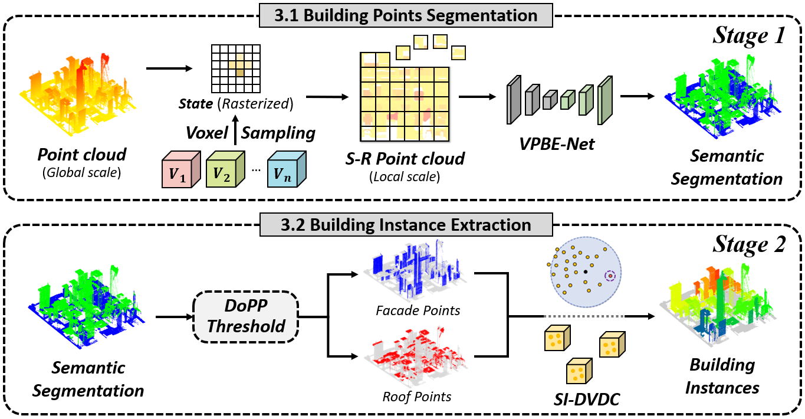

# City-BIS: City-scale Building Instance Segmentation from LiDAR Point Clouds via Structure-aware Method

## Abstract
City-scale building instance segmentation from LiDAR point cloud is of great significance to urban planning management, disaster response and recovery, and land resource management. However, due to the complexity of urban environment and sparse nature of LiDAR data, existing methods are often limited by the problems of obscured building boundaries and incomplete building structures, particularly in densely populated urban areas with diverse architectural styles. To address these challenges, we proposed a novel pipeline that automatically extracts individual buildings from airborne LiDAR point clouds and is especially aware of the building structures. The proposed method encompasses two main stages, building points semantic segmentation and individual building extraction. First, we design a lightweight semantic segmentation network, VPBE-Net, that innovatively utilizes voxel-point cloud fused features to efficiently extract building points from large-scale point cloud. Second, building instances are automatically and robustly extracted using a graph-based algorithm SI-DVDC, which comprehensively considers both building structure property at the object-level and density accessibility at the point-level. The proposed method is evaluated on three public benchmark datasets and one self-annotated dataset. For the semantics, OA and mIoU metrics reach 89.26% and 75.40%, which is 2.22% and 3.25% higher than the state-of-the-art methods, respectively. For the building instance, the instance-level quality metric on the test datasets is 88.65% and 76.97%, respectively.

 

## Dataset Download
We provide the City-BIS dataset to facilitate future research for building instance segmentation in both suburban and urban areas. City-BIS dataset totally encompasses more than 7,000 buildings of various types within an area of 9.6 square kilometre, which is organised in a well-structured manner and contains two parts. The first part is the original version of the dataset, that contains point clouds with building instance ID annotations for three representative regions. The second part is the finely labelled version of the dataset, that adds the fine-grained attribute annotations of the buildings (e.g., roof type, height and coverage, etc).

The first part of City-BIS is available at the [City-BIS dataset](https://pan.baidu.com/s/1ThysM2QRsR3LRpescn--kA?pwd=ezqh)

## Requirements
The code has been tested on:
- Ubuntu 20.04
- CUDA 12.2
- Python 3.10
- Pytorch 2.1.0
- NVIDIA Tesla V100 GPU and NVIDIA Tesla T4 GPU.

## Installation
  ```
  # create and activate the conda environment
  conda create -n BIS python=3.10
  conda activate BIS

  # install the necessary packages
  pip install -r requirements.txt
  ```

## Building Semantic Segmentation
  You can try the building points segmentation via VPBE-Net. The codes of data preprocessing and network training have been released!
  
  Please collate the data into a form consistent with S3DIS and place them to ./data.

  Ensure that relevant dependencies have been updated.
  ```
  sudo apt update
  sudo apt install python3-dev python3-pip python3-tk
  pip install mayavi
  ```
  
  Then, you can train the VPBE-Net with the following command on your self-constructed dataset:
  ```
  python train_City_BIS.py
  ```

  To eval VPBE-Net based on the pre-trained model, you can use the following commands:
  ```
  python test_models.py
  ```

## Building Instance Extraction
  To automatically assign instance-level building IDs, you can use the SI-DVDC method, and the code to be released soon.

## Contact us
  For any questions, please contact us via lijp57@mail2.sysu.edu.cn.


